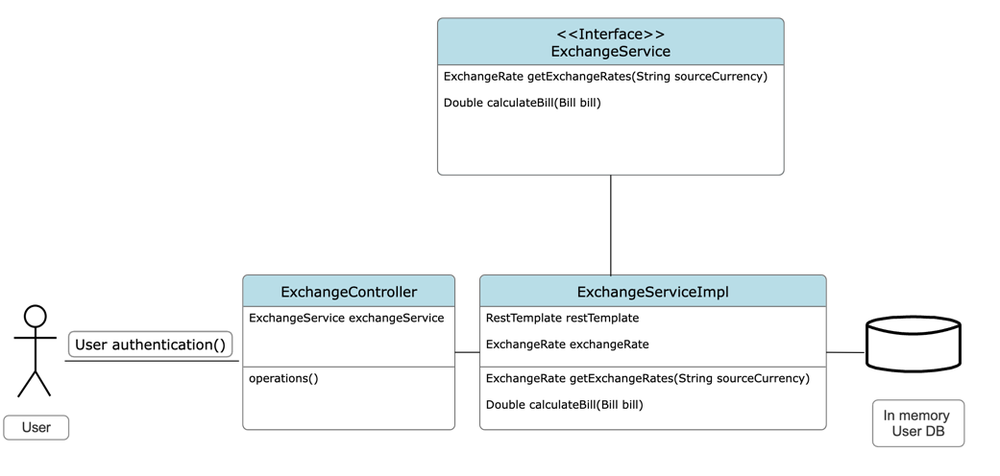
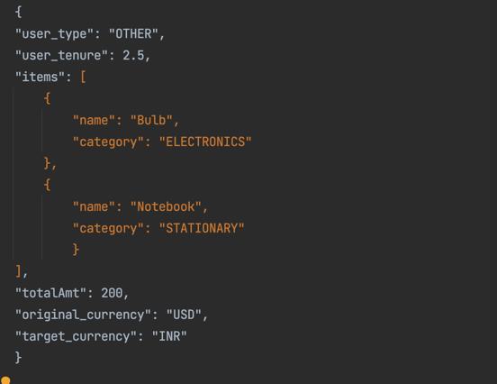
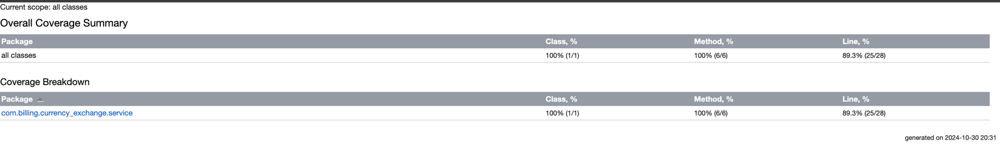
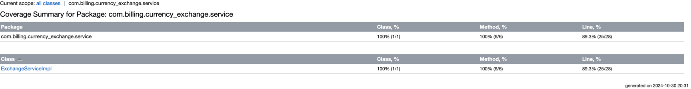

# BillExchangeService

This is a service integrated with third party API https://v6.exchangerate-api.com/v6/ for fetching currency exchange rates.
Goal of this service is to calculate discount on bill amount and apply target currency rate to generate final bill amount.

UML diagram which illustrates design of application:

## API information

Two APIs are implemented as follows:

1. GET: http://localhost:8080/api/exchangeRates/{baseCurrency}
   This API can be used by Admin to fetch or check latest currency conversion rates. Replace {baseCurrency} by currency code for which you need exchange rates for eg. USD

2. GET: http://localhost:8080/api/calculate
   This API can be used by users or admin to get currency exchanged bill amount. Sample request body:

   

These APIs are authenticated against user's role and currenctly we have 2 in=memory users created in security configuration.

User with ADMIN role can access both APIs: 
    User Id: admin
    Password: admin123

User with USER role:
    User Id: user
    Password: user123

## Build and run application

To build app use command :` mvn clean install`

To run application:

Either run main class CurrencyExchangeApplication directly from IDE

Or from command line using command: `mvn spring-boot:run`

## Test application

To test application I have created unit test ExchangeServiceTest which will test core implementation part of application that is ExchangeService.
In order to test service I have used mockito to mock restTemplate bean which is being used to call third part exchange rates API.

Run this test with coverage which will generate coverage report in htmlReport folder as below.

